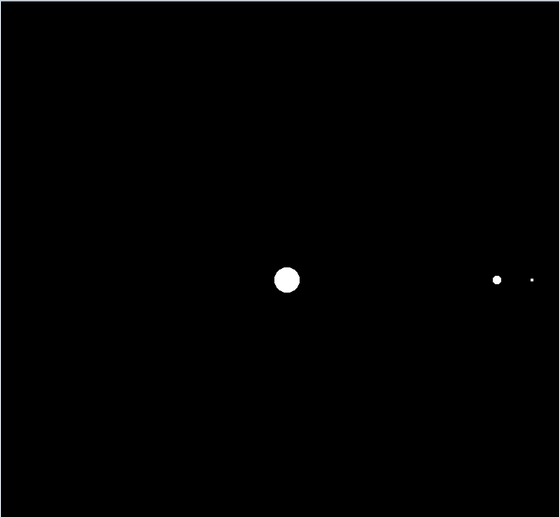

<div align="center">

# N-Body Gravity

*A star, a planet and its moon under mutual Newtonian gravity, integrated with semi-implicit Euler in Pygame.*




</div>

## About

A three-body gravity simulation in one Pygame file (`SimulacionPlanetas.py`, "planet simulation"). A heavy star starts in the middle of a 1400 × 800 window, a planet orbits it and a small moon orbits the planet. Every body pulls on every other one, so the star wobbles as well. The vector class, the force sum and the integrator are written from scratch; Pygame only draws the filled circles. There are no controls: it is a scene to watch.

## Quick start

```bash
python -m pip install -r requirements.txt
python SimulacionPlanetas.py
```

## How it works

- **Bodies.** Each `Planet` has a mass, a position and a velocity, and is drawn with radius $r = \sqrt{m/\pi}$, so its area in pixels equals its mass. The star has mass 1000 and a radius of about 18 px, the planet 100 (about 6 px) and the moon 7 (about 1.5 px).
- **Gravity.** Before anything moves, every body sums the pull of all the others, with a scaled constant $G = 66.7$:

  ```math
  \mathbf a_i = \sum_{j \neq i} \frac{G\, m_j}{\lVert \mathbf x_j - \mathbf x_i \rVert^2}\;
  \frac{\mathbf x_j - \mathbf x_i}{\lVert \mathbf x_j - \mathbf x_i \rVert}
  ```

- **Integration.** Semi-implicit (symplectic) Euler: the velocity is updated first and the position then uses the new velocity. The step is the real time $\Delta t$ since the previous frame multiplied by `timeScale` $= 20$:

  ```math
  \mathbf v \leftarrow \mathbf v + 20\,\mathbf a\,\Delta t,\qquad \mathbf x \leftarrow \mathbf x + 20\,\mathbf v\,\Delta t
  ```

- **Initial conditions.** The planet starts 300 px to the right of the star, moving at 16.2 relative to it, a little above the two-body circular speed $\sqrt{G (M + m) / r} \approx 15.6$. It therefore starts at the near end of an ellipse: in a test run its distance from the star varied between 300 and about 430 px, with one orbit every 8 seconds of real time. The moon starts 50 px beyond the planet at 10 relative to it, below the circular 11.9, so its distance from the planet swung between about 24 and 50 px, with one orbit every 0.8 seconds.

## Limitations

- The total momentum is not zero: the star's $1000 \times 1.2$ does not cancel the planet's and moon's $1675$ in the opposite direction. The whole system drifts upwards, and in a test run the star left the top of the window after about 45 seconds. There is no camera or reset.
- There are no orbit trails, labels, zoom or pause, so the moon is a dot about 3 px wide.
- Bodies never collide and there is no softening, so a close encounter gives huge accelerations, and two bodies at the same point would divide by zero.
- The step follows the wall clock and the loop is uncapped, so it keeps one CPU core busy, and any stall, such as dragging the window, becomes one large step that can throw the orbits off.

## Background

Written in or before June 2023; the file comes from a code backup made that month and was put under version control in 2026. It uses the same hand-written `Vector2` class as the ball-collision experiments from the same backup, including a few methods it never calls.

---

<div align="center"><sub>Part of <a href="https://github.com/lnivan">lnivan's projects</a> · <b>Simulations</b></sub></div>
